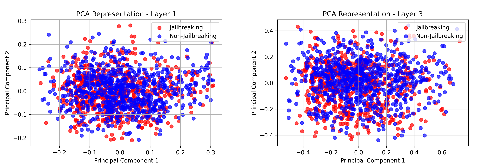

# Intervention-Jailbreak

For full article please visit -> https://logits.substack.com/p/jailbreak-and-intervention-chronicles

This project investigates the detection and mitigation of "jailbroken modes" in Large Language Models (LLMs). By analyzing internal activations in response to malicious prompts, the aim is to identify patterns indicative of jailbreak attempts and develop strategies to prevent models from complying with such prompts.

## Project Structure

- **collecting_jailbreaking_prompts.py**: Script for gathering prompts that may induce jailbreak behavior in LLMs.

- **extracting_activations.py**: Extracts and records the model's activations across all layers when processing various prompts.

- **display_data.py**: Utilities for visualizing and analyzing the collected activation data.

- **tsne_vis.py**: Performs t-SNE visualization to identify clusters within the activation data.

- **with_intervention.py**: Implements intervention strategies aimed at reducing the likelihood of the model responding to malicious prompts.

- **prompts/**: Directory containing various prompts used during testing and analysis.

- **pca_layer_images/** & **tsne_test_layer_images/**: Directories storing visualizations of the model's activations, including PCA and t-SNE plots.

## Getting Started

Please follow this in order to replicate experiments
1. **Clone the Repository**:

   ```bash
   git clone https://github.com/Luisibear98/intervention-jailbreak.git
   cd intervention-jailbreak
   ```

2. **Collect Jailbreaking Prompts**:

Use the collecting_jailbreaking_prompts.py script to gather prompts that may induce jailbreak behavior.

3. **Extract Model Activations**:

Run extracting_activations.py to record the model's activations when processing the collected prompts.

5. **Visualize Data**:

Utilize display_data.py and tsne_vis.py to analyze and visualize the activation data.

5. **Implement Intervention**:

Apply the strategies in with_intervention.py to mitigate the model's compliance with malicious prompts.


## Plots examples

The following shows activations before intervention on earlier layers, as can be seen, there are no clear differences between jailbreak and non-jailbreak prompts activations.




However, deeper layers shows more differences between jailbreak and non-jailbreak prompts activations.


After intervention, we have "corrected the activations", forzing the jailbroken prompts to shift to the non-jailbroken area.


